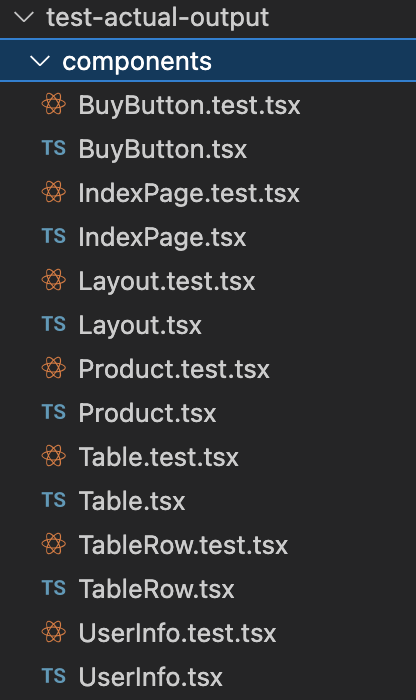
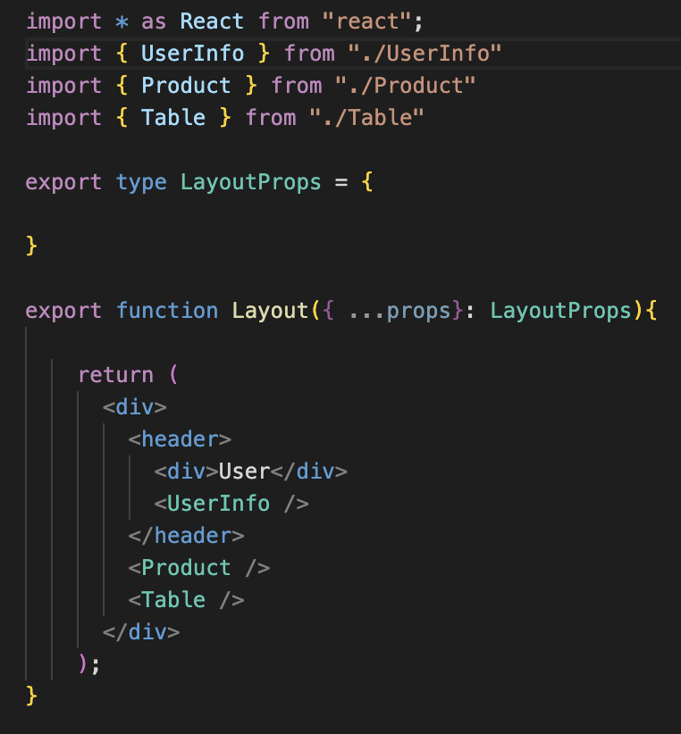
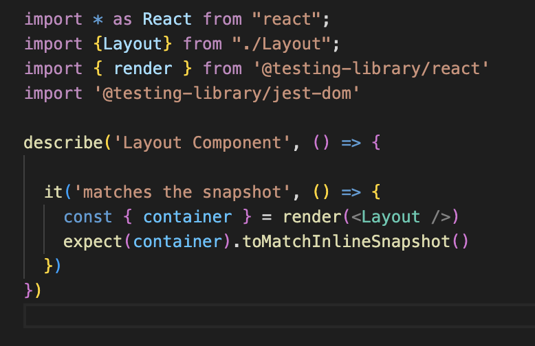

# html2tsx

[](https://travis-ci.org/nilportugues/html2tsx)

Tool that breaks your html into React components, saving their
code into files. Imports of children components, TSX with children components,
etc - you're all set.

## Installation

```
npm install html2tsx --global
```

## Usage

Basically:

```
html2tsx --entry=your_html.html --outDir=/your_directory   
```

First, let's observe this example html that will be breaked into files with components code in them.
(taken from tests folder, file entry1.html)

```html
<html>
  <head>
    <title></title>
  </head>
  <body>
    <div b-name="IndexPage">
      <div b-name="Layout">
        <header>
          <div>User</div>
          <div b-name="UserInfo">
            <div class="user-info-class">Username: Alan</div>
          </div>
        </header>
        <div b-name="Product">
          <div>Product name</div>
          <div>Product price</div>
          <div>Product count</div>
          <div b-jsx-lib="react" b-name="BuyButton">
            <button>buy</button>
            <div>
              <div>Buy as</div>
              <div b-name="UserInfo"></div>
            </div>
          </div>
        </div>
        <table b-name="Table">
          <thead>
            <tr>
              <td>Header first</td>
              <td>Header second</td>
              <td>Header third</td>
            </tr>
          </thead>
          <tbody>
            <tr b-name="TableRow">
              <td>First</td>
              <td>Second</td>
              <td>Third</td>
            </tr>
          </tbody>
        </table>
      </div>
    </div>
  </body>
</html>
```

So, you see some attributes that are not your common html attributes.
With the help of those html2tsx knows what should be breaked and saved into components.

### Attributes overview

- **b-name="ComponentName"** - this attribute defines components name. Name of component class and also name of file, where code will be saved.

## Output

In the output folder you would see:



And this is what inside of LayoutPage.tsx file:



And this is what inside of LayoutPage.test.tsx file:




## Development

Issues, tests and ideas are welcome!

## Contributing

1. Fork it ( https://github.com/nilportugues/html2tsx/fork )
2. Create your feature branch (git checkout -b my-new-feature)
3. Commit your changes (git commit -am 'Add some feature')
4. Push to the branch (git push origin my-new-feature)
5. Create a new Pull Request

## Contributors

- [nilportugues](https://github.com/nilportugues) - maintainer of this fork.

## Special thanks ot

- [idchlife](https://github.com/idchlife) - original code creator.